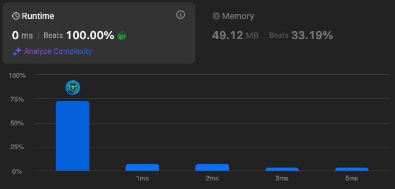

# 1389. Create Target Array in the Given Order

🌱 Difficulty: `Easy`

❤️ Leetcode Problem Description: [1389. Create Target Array in the Given Order - Problem - Description](https://leetcode.com/problems/create-target-array-in-the-given-order/)

❤️ Leetcode Solution by Rayana Sales: [1389. Create Target Array in the Given Order - Solution](https://leetcode.com/problems/create-target-array-in-the-given-order/solutions/6046007/topic)

💁🏻‍♀️ All my solved LeetCode problems on GitHub: [rayanasales/leetcode](https://github.com/rayanasales/leetcode)

❤️‍🔥❤️‍🔥❤️‍🔥 If it's help, please up 🔝 vote! ❤️‍🔥❤️‍🔥❤️‍🔥

---



## 🚀 Code Solution

```javascript []
var createTargetArray = function (nums, index) {
  let targetArray = [];
  for (let i = 0; i < nums.length; i++) {
    let targetIndex = index[i];
    let targetValue = nums[i];
    targetArray.splice(targetIndex, 0, targetValue); // 0 represents how many items must be deleted
  }
  return targetArray;
};
```

## 💎 Strategy

To solve this problem, the approach focuses on creating the `targetArray` by inserting elements from the `nums` array into specific positions based on the `index` array. Here’s a step-by-step breakdown of the strategy:

1. Initialize an Empty Array: Begin by initializing an empty array, `targetArray`, which will hold the final result.

2. Iterate Over `nums` and `index` Simultaneously: Using a `for` loop, process each element in the `nums` and `index` arrays. At each step, take:

   - `targetIndex` = the value at `index[i]`, which indicates where to insert the current element.
   - `targetValue` = the value at `nums[i]`, which is the value to be inserted at `targetIndex`.

3. Use `splice` for Ordered Insertion: The `splice()` function in JavaScript is employed to insert `targetValue` at the position `targetIndex`. When `splice()` is called with `0` as the second parameter, it performs an insertion without deleting any existing elements. This maintains the order of insertion as required.

4. Return `targetArray` After the Loop Completes: After all elements in `nums` have been processed, `targetArray` holds the desired order as specified, so it is returned as the result.

This solution leverages JavaScript's `splice()` method, which is effective here because each insertion modifies the array in a specific location without needing complex operations.

## 🔎 Step-by-Step Debugging

Let’s examine how the function handles each example input step-by-step:

- Example 1: `nums = [0,1,2,3,4]`, `index = [0,1,2,2,1]`

  - Step 1: Insert `0` at index `0` → `targetArray = [0]`
  - Step 2: Insert `1` at index `1` → `targetArray = [0, 1]`
  - Step 3: Insert `2` at index `2` → `targetArray = [0, 1, 2]`
  - Step 4: Insert `3` at index `2` → `targetArray = [0, 1, 3, 2]`
  - Step 5: Insert `4` at index `1` → `targetArray = [0, 4, 1, 3, 2]`
  - Result: `[0, 4, 1, 3, 2]`

- Example 2: `nums = [1,2,3,4,0]`, `index = [0,1,2,3,0]`

  - Step 1: Insert `1` at index `0` → `targetArray = [1]`
  - Step 2: Insert `2` at index `1` → `targetArray = [1, 2]`
  - Step 3: Insert `3` at index `2` → `targetArray = [1, 2, 3]`
  - Step 4: Insert `4` at index `3` → `targetArray = [1, 2, 3, 4]`
  - Step 5: Insert `0` at index `0` → `targetArray = [0, 1, 2, 3, 4]`
  - Result: `[0, 1, 2, 3, 4]`

- Example 3: `nums = [1]`, `index = [0]`
  - Step 1: Insert `1` at index `0` → `targetArray = [1]`
  - Result: `[1]`

## 📊 Time and Space Complexity Analysis

- Time Complexity: The solution has a time complexity of `O(n^2)`, where `n` is the length of the `nums` array. This is because, on each iteration of the loop, the `splice()` method may need to shift elements in `targetArray` to make room for the new insertion, leading to an `O(n)` operation in the worst case. Therefore, with `n` iterations, this results in `O(n^2)` complexity.

- Space Complexity: The space complexity is `O(n)`, as we store all elements from `nums` in `targetArray`.

---

# Please UPVOTE if this was helpful 🔝🔝🔝❤️❤️❤️

and check out all my solved LeetCode problems on GitHub: [rayanasales/leetcode](https://github.com/rayanasales/leetcode) 🤙😚🤘


