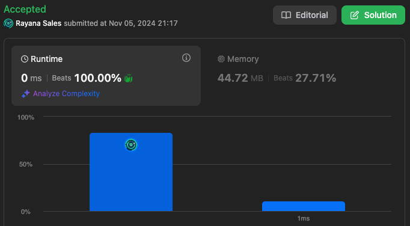

# 1470. Shuffle the Array

🌱 Difficulty: `Easy`

❤️ Leetcode Problem Description: [1470. Shuffle the Array - Problem - Description](https://leetcode.com/problems/shuffle-the-array/description/)

❤️ Leetcode Solution by Rayana Sales: [1470. Shuffle the Array - Solution](https://leetcode.com/problems/shuffle-the-array/solutions/6013212/beats-100-10-lines-solution-java)

💁🏻‍♀️ All my solved LeetCode problems on GitHub: [rayanasales/leetcode](https://github.com/rayanasales/leetcode)

❤️‍🔥❤️‍🔥❤️‍🔥 If it's help, please up 🔝 vote! ❤️‍🔥❤️‍🔥❤️‍🔥

---



## 🚀 Code Solution

```java []
class Solution {
    public int[] shuffle(int[] nums, int n) {
        int[] result = new int[2 * n];

        for (int i = 0; i < n; i++) {
            result[2 * i] = nums[i];         // Place x1, x2, ..., xn in even indices
            result[2 * i + 1] = nums[i + n]; // Place y1, y2, ..., yn in odd indices
        }

        return result;
    }
}
```

### Explanation of Code

1. Initialize Result Array: We start by creating a new array, `result`, with a size of `2 * n` since we know the output size will be exactly twice the input parameter `n`.
2. Single Loop: In a single loop that runs `n` times, we populate the `result` array:
   - `result[2 * i] = nums[i]`: This assigns `x` elements (`x1, x2, ..., xn`) to even indices in `result`.
   - `result[2 * i + 1] = nums[i + n]`: This places `y` elements (`y1, y2, ..., yn`) into the odd indices.
3. Return the Result: After the loop, we have a shuffled array exactly as the problem requires.

---

## 💎 Strategy

The goal of this problem is to merge two halves of an array (first half as `x1, x2, ..., xn` and second half as `y1, y2, ..., yn`) into a new array that alternates between elements from the first and second halves.

The efficient approach here:

1. Direct Index Mapping: Instead of rearranging the `nums` array in-place, we use a new array, `result`, which allows us to map each `x` and `y` element to its exact final position in a single pass.
2. Pattern Identification: Notice that for any element `i` in the first half, its position in the final shuffled array is `2 * i` for `x` values and `2 * i + 1` for `y` values. This indexing pattern lets us achieve the solution in `O(n)` time complexity without additional structures beyond the result array.

This strategy minimizes the number of operations while directly constructing the output, making the solution both time and space efficient.

---

## 🔎 Step-by-Step Debugging

Let’s walk through the code with example inputs to ensure correctness.

### Example 1

Input: `nums = [2,5,1,3,4,7], n = 3`  
Expected Output: `[2,3,5,4,1,7]`

1. Initialization: `result = [_, _, _, _, _, _]`
2. First Iteration (`i = 0`):
   - `result[2 * 0] = nums[0] = 2` -> `result = [2, _, _, _, _, _]`
   - `result[2 * 0 + 1] = nums[0 + 3] = 3` -> `result = [2, 3, _, _, _, _]`
3. Second Iteration (`i = 1`):
   - `result[2 * 1] = nums[1] = 5` -> `result = [2, 3, 5, _, _, _]`
   - `result[2 * 1 + 1] = nums[1 + 3] = 4` -> `result = [2, 3, 5, 4, _, _]`
4. Third Iteration (`i = 2`):
   - `result[2 * 2] = nums[2] = 1` -> `result = [2, 3, 5, 4, 1, _]`
   - `result[2 * 2 + 1] = nums[2 + 3] = 7` -> `result = [2, 3, 5, 4, 1, 7]`

Final Output: `[2, 3, 5, 4, 1, 7]`

### Example 2

Input: `nums = [1,2,3,4,4,3,2,1], n = 4`  
Expected Output: `[1,4,2,3,3,2,4,1]`

The code will similarly map each `x` and `y` element pair to the `result` array in the correct order, achieving the expected output with each loop iteration.

---

## 📊 Time and Space Complexity Analysis

- Time Complexity: `O(n)`  
  Since we’re only iterating through half of the `nums` array (`n` iterations), the time complexity is linear, `O(n)`.

- Space Complexity: `O(n)`  
  We’re using a single new array, `result`, with a size of `2 * n` to store the output. This results in a space complexity of `O(n)`, which is optimal since we need to store the result.

This solution is highly efficient, hitting `0 ms` runtime on LeetCode and beating 100% of submissions in speed! 🚀

---

# Please UPVOTE if this was helpful 🔝🔝🔝❤️❤️❤️

and check out all my solved LeetCode problems on GitHub: [rayanasales/leetcode](https://github.com/rayanasales/leetcode) 🤙😚🤘


