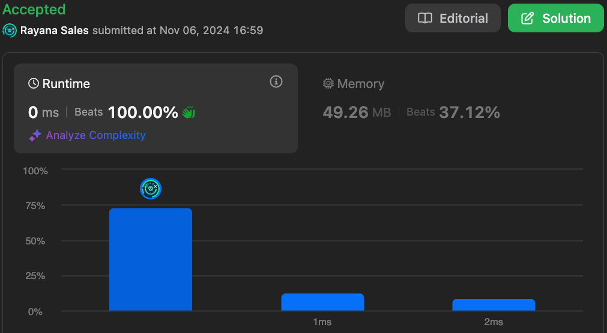

# 1672. Richest Customer Wealth

🌱 Difficulty: `Easy`

❤️ Leetcode Problem Description: [1672. Richest Customer Wealth - Problem - Description](https://leetcode.com/problems/richest-customer-wealth/description/)

❤️ Leetcode Solution by Rayana Sales: [1672. Richest Customer Wealth - Solution](https://leetcode.com/problems/richest-customer-wealth/solutions/6016852/beats-100-10-lines-solution-beginner-friendly-javascript)

💁🏻‍♀️ All my solved LeetCode problems on GitHub: [rayanasales/leetcode](https://github.com/rayanasales/leetcode)

❤️‍🔥❤️‍🔥❤️‍🔥 If it's help, please up 🔝 vote! ❤️‍🔥❤️‍🔥❤️‍🔥

---



## 🚀 Code Solution

```javascript []
var maximumWealth = function (accounts) {
  let highestWealth = 0;
  for (let customer = 0; customer < accounts.length; customer++) {
    let customerAccount = accounts[customer];
    let customerWealth = 0;
    for (let bank = 0; bank < customerAccount.length; bank++)
      customerWealth += customerAccount[bank];
    highestWealth =
      customerWealth > highestWealth ? customerWealth : highestWealth;
  }
  return highestWealth;
};
```

---

## 💎 Strategy

In this problem, we are given a 2D array called `accounts`, where each row represents a customer's wealth across various bank accounts. Our goal is to find the wealthiest customer by summing up each customer’s bank balances and then returning the maximum sum.

1. Initialize a Tracker: We initialize a variable, `highestWealth`, to store the maximum wealth encountered during our loop through customers. This variable starts at zero since wealth values are always positive.

2. Iterate Through Each Customer: We use a loop to access each row of `accounts`. Each row represents the bank accounts for a particular customer.

3. Sum Wealth per Customer: For each customer, initialize a `customerWealth` variable to zero. We then loop over each element in the customer's row, adding each bank balance to `customerWealth`.

4. Compare Wealth: Once the inner loop finishes summing a customer’s wealth, we compare `customerWealth` to `highestWealth`. If `customerWealth` is higher, we update `highestWealth`.

5. Return the Richest Wealth: After looping through all customers, `highestWealth` will contain the maximum wealth, which is returned as the result.

---

## 🔎 Step-by-Step Debugging

Let's break down how the code handles each example:

### Example 1: `accounts = [[1,2,3],[3,2,1]]`

- Step 1: `highestWealth` is initialized to `0`.
- Customer 1: Sum of `[1, 2, 3]` = `6`. Since `6 > 0`, we set `highestWealth` to `6`.
- Customer 2: Sum of `[3, 2, 1]` = `6`. `highestWealth` remains `6` since `6` is not greater than `6`.
- Final Output: `6`.

### Example 2: `accounts = [[1,5],[7,3],[3,5]]`

- Step 1: `highestWealth` is initialized to `0`.
- Customer 1: Sum of `[1, 5]` = `6`. Update `highestWealth` to `6`.
- Customer 2: Sum of `[7, 3]` = `10`. Update `highestWealth` to `10`.
- Customer 3: Sum of `[3, 5]` = `8`. `highestWealth` remains `10`.
- Final Output: `10`.

### Example 3: `accounts = [[2,8,7],[7,1,3],[1,9,5]]`

- Step 1: `highestWealth` is initialized to `0`.
- Customer 1: Sum of `[2, 8, 7]` = `17`. Update `highestWealth` to `17`.
- Customer 2: Sum of `[7, 1, 3]` = `11`. `highestWealth` remains `17`.
- Customer 3: Sum of `[1, 9, 5]` = `15`. `highestWealth` remains `17`.
- Final Output: `17`.

---

## 📊 Time and Space Complexity Analysis

- Time Complexity: The solution is `O(m * n)`, where `m` is the number of customers (rows) and `n` is the number of bank accounts per customer (columns). We visit each element in the matrix once to compute the wealth for each customer.
- Space Complexity: The space complexity is `O(1)`, as we are only using a constant amount of extra space (`highestWealth` and `customerWealth`).

This code is optimal in both time and space, achieving maximum efficiency for this problem.

---

# Please UPVOTE if this was helpful 🔝🔝🔝❤️❤️❤️

and check out all my solved LeetCode problems on GitHub: [rayanasales/leetcode](https://github.com/rayanasales/leetcode) 🤙😚🤘


