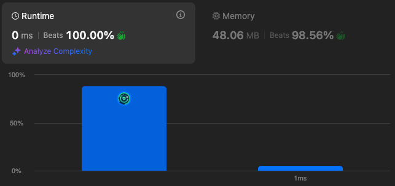

# 1816. Truncate Sentence

🌱 Difficulty: `Easy`

❤️ Leetcode Problem Description: [1816. Truncate Sentence - Problem - Description](https://leetcode.com/problems/truncate-sentence/)

❤️ Leetcode Solution by Rayana Sales: [1816. Truncate Sentence - Solution](https://leetcode.com/problems/truncate-sentence/solutions/6066986/topic)

💁🏻‍♀️ All my solved LeetCode problems on GitHub: [rayanasales/leetcode](https://github.com/rayanasales/leetcode)

❤️‍🔥❤️‍🔥❤️‍🔥 If it's help, please up 🔝 vote! ❤️‍🔥❤️‍🔥❤️‍🔥

---



## 🚀 Code Solution

```javascript []
var truncateSentence = function (sentence, k) {
  return sentence.split(" ").slice(0, k).join(" ");
};
```

---

## 💎 Strategy

The goal of this problem is to truncate the input sentence so it contains only the first `k` words. The solution uses string manipulation and array methods to achieve this efficiently. The approach is as follows:

1. Split the Sentence into Words:

   - Use the `split(" ")` method to divide the sentence into an array of words, where each word is separated by a space.

2. Extract the First `k` Words:

   - Use the `slice(0, k)` method on the array to extract the first `k` words. This method selects a portion of the array starting at index `0` and ending at index `k - 1` (non-inclusive).

3. Join the Words Back into a Sentence:
   - Use the `join(' ')` method to combine the extracted words back into a single string, with a space separating each word.

The result is the truncated sentence containing only the first `k` words.

---

## 🔎 Step-by-Step Debugging

### Example 1:

- Input: `s = "Hello how are you Contestant"`, `k = 4`
  - `split(" ")`: `["Hello", "how", "are", "you", "Contestant"]`
  - `slice(0, 4)`: `["Hello", "how", "are", "you"]`
  - `join(' ')`: `"Hello how are you"`
- Output: `"Hello how are you"`

### Example 2:

- Input: `s = "What is the solution to this problem"`, `k = 4`
  - `split(" ")`: `["What", "is", "the", "solution", "to", "this", "problem"]`
  - `slice(0, 4)`: `["What", "is", "the", "solution"]`
  - `join(' ')`: `"What is the solution"`
- Output: `"What is the solution"`

### Example 3:

- Input: `s = "chopper is not a tanuki"`, `k = 5`
  - `split(" ")`: `["chopper", "is", "not", "a", "tanuki"]`
  - `slice(0, 5)`: `["chopper", "is", "not", "a", "tanuki"]`
  - `join(' ')`: `"chopper is not a tanuki"`
- Output: `"chopper is not a tanuki"`

---

## 📊 Time and Space Complexity Analysis

- Time Complexity:

  - `split(" ")`: `O(n)` where `n` is the length of the input sentence (splits the sentence into words).
  - `slice(0, k)`: `O(k)` (extracts the first `k` words from the array).
  - `join(' ')`: `O(k)` (joins `k` words back into a string).
  - Overall: `O(n)` (dominated by the `split(" ")` operation).

- Space Complexity:
  - The `split` operation creates an array of words, requiring `O(n)` space.
  - `slice` creates a subarray with `O(k)` space.
  - The `join` operation creates the final string, which is `O(n)` in the worst case.
  - Overall: `O(n)` (dominated by the space required for the array of words).

---

# Please UPVOTE if this was helpful 🔝🔝🔝❤️❤️❤️

and check out all my solved LeetCode problems on GitHub: [rayanasales/leetcode](https://github.com/rayanasales/leetcode) 🤙😚🤘


