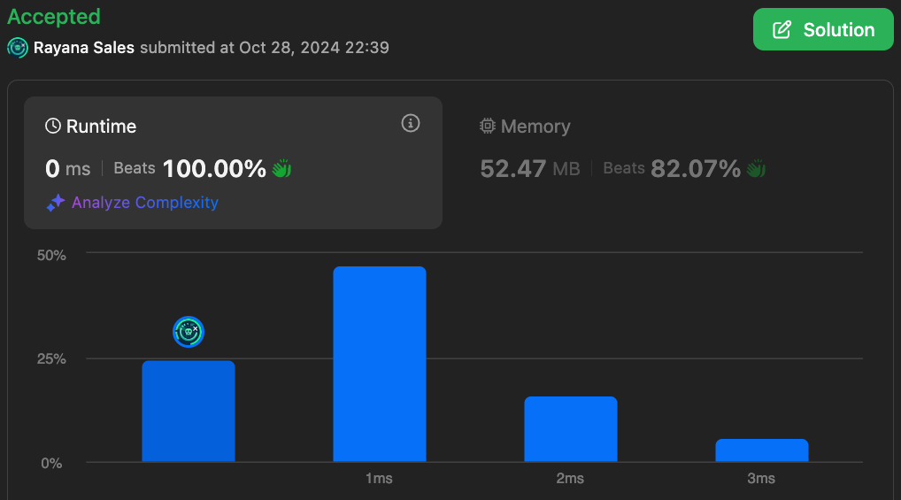

# 1920. Build Array from Permutation

🌱 Difficulty: `Easy`

❤️ Leetcode Problem Description: [1920. Build Array from Permutation - Problem - Description](https://leetcode.com/problems/build-array-from-permutation/)

❤️ Leetcode Solution by Rayana Sales: [1920. Build Array from Permutation - Solution](https://leetcode.com/problems/build-array-from-permutation/solutions/5980602/topic)

💁🏻‍♀️ All my solved LeetCode problems on GitHub: [rayanasales/leetcode](https://github.com/rayanasales/leetcode)

❤️‍🔥❤️‍🔥❤️‍🔥 If it's help, please up 🔝 vote! ❤️‍🔥❤️‍🔥❤️‍🔥

---

## 🚀 Commented Solution

```javascript []
var buildArray = function (nums) {
  let ans = [];
  for (let i = 0; i < nums.length; i++) ans[i] = nums[nums[i]];
  return ans;
};
```

### 🏆 Runtime 0ms Beats 100.00%



---

# Please UPVOTE if this was helpful 🔝🔝🔝❤️❤️❤️

and check out all my solved LeetCode problems on GitHub: [rayanasales/leetcode](https://github.com/rayanasales/leetcode) 🤙😚🤘


