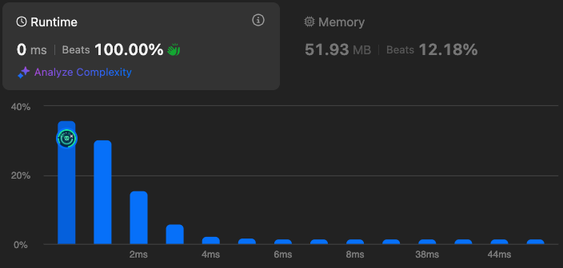

# 3110. Score of a String

🌱 Difficulty: `Easy`

❤️ Leetcode Problem Description: [3110. Score of a String - Problem - Description](https://leetcode.com/problems/score-of-a-string/description/)

❤️ Leetcode Solution by Rayana Sales: [3110. Score of a String - Solution](https://leetcode.com/problems/score-of-a-string/solutions/6067009/beats-100-9-lines-solution-beginner-friendly-javascript)

💁🏻‍♀️ All my solved LeetCode problems on GitHub: [rayanasales/leetcode](https://github.com/rayanasales/leetcode)

❤️‍🔥❤️‍🔥❤️‍🔥 If it's help, please up 🔝 vote! ❤️‍🔥❤️‍🔥❤️‍🔥

---



## 🚀 Code Solution

```javascript []
var scoreOfString = function (word) {
  let score = 0;

  for (let i = 0; i < word.length; i++) {
    if (i === word.length - 1) return score;

    let currentAscii = word[i].charCodeAt(0);
    let nextAscii = word[i + 1].charCodeAt(0);
    score += Math.abs(currentAscii - nextAscii);
  }
};
```

---

## 💎 Strategy

To solve the problem, the strategy involves iterating through the string and calculating the score based on the absolute differences between the ASCII values of adjacent characters. Here's the step-by-step breakdown:

1. Initialize the Score:

   - Start with a `score` variable set to `0`. This will accumulate the total score of the string.

2. Iterate Through the String:

   - Use a `for` loop to traverse the string from the first character to the second-to-last character.

3. Calculate ASCII Values:

   - For each character at index `i`, calculate its ASCII value using `charCodeAt(0)`.

4. Compute Absolute Difference:

   - Calculate the absolute difference between the ASCII value of the current character and the next character using `Math.abs()`.

5. Update Score:

   - Add the calculated absolute difference to the `score`.

6. Return the Score:
   - Once all adjacent character pairs are processed, return the final `score`.

This approach ensures all adjacent pairs are accounted for without unnecessary computations.

---

## 🔎 Step-by-Step Debugging

### Example 1:

- Input: `s = "hello"`
  - ASCII values: `['h' = 104, 'e' = 101, 'l' = 108, 'l' = 108, 'o' = 111]`
  - Step 1: `|104 - 101| = 3` → `score = 3`
  - Step 2: `|101 - 108| = 7` → `score = 10`
  - Step 3: `|108 - 108| = 0` → `score = 10`
  - Step 4: `|108 - 111| = 3` → `score = 13`
- Output: `13`

### Example 2:

- Input: `s = "zaz"`
  - ASCII values: `['z' = 122, 'a' = 97, 'z' = 122]`
  - Step 1: `|122 - 97| = 25` → `score = 25`
  - Step 2: `|97 - 122| = 25` → `score = 50`
- Output: `50`

---

## 📊 Time and Space Complexity Analysis

### Time Complexity:

- Calculation:
  - The `for` loop iterates through the string once (`O(n)`).
  - Inside the loop, `charCodeAt` and `Math.abs` are constant-time operations (`O(1)`).
  - Overall: `O(n)`, where `n` is the length of the string.

### Space Complexity:

- The algorithm uses a constant amount of space for variables (`score`, `currentAscii`, `nextAscii`).
- Overall: `O(1)` since no additional data structures are used.

---

# Please UPVOTE if this was helpful 🔝🔝🔝❤️❤️❤️

and check out all my solved LeetCode problems on GitHub: [rayanasales/leetcode](https://github.com/rayanasales/leetcode) 🤙😚🤘


