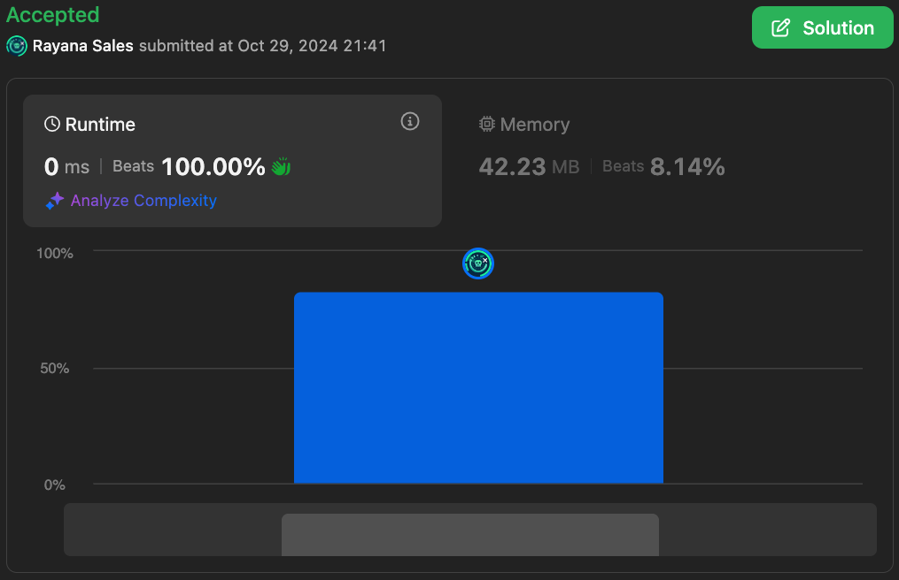

# 3190. Find Minimum Operations to Make All Elements Divisible by Three

🌱 Difficulty: `Easy`

❤️ Leetcode Problem Description: [3190. Find Minimum Operations to Make All Elements Divisible by Three - Problem - Description](https://leetcode.com/problems/find-minimum-operations-to-make-all-elements-divisible-by-three/)

❤️ Leetcode Solution by Rayana Sales: [3190. Find Minimum Operations to Make All Elements Divisible by Three - Solution](https://leetcode.com/problems/find-minimum-operations-to-make-all-elements-divisible-by-three/solutions/5984585/topic)

💁🏻‍♀️ All my solved LeetCode problems on GitHub: [rayanasales/leetcode](https://github.com/rayanasales/leetcode)

❤️‍🔥❤️‍🔥❤️‍🔥 If it's help, please up 🔝 vote! ❤️‍🔥❤️‍🔥❤️‍🔥

---



## 🚀 Code Solution

```java []
public class Solution {
    public int minimumOperations(int[] nums) {
        int operations = 0;
        for (int n : nums) if (n % 3 != 0) operations++;
        return operations;
    }
}
```

---

## 🌎 Strategy

### The Challenge

We are tasked with finding the minimum number of operations to make all elements of an integer array divisible by 3. Each operation allows us to either increment or decrement any element by 1. The goal is to return the minimum number of such operations.

### Approach

The key observation here is that for any number `n`, there are three possible scenarios based on its remainder when divided by 3:

- If `n % 3 == 0`, the number is already divisible by 3, and no operation is needed.
- If `n % 3 == 1`, it means the number is 1 greater than a multiple of 3, so one decrement (`-1`) will make it divisible by 3.
- If `n % 3 == 2`, the number is 1 less than a multiple of 3, so one increment (`+1`) will make it divisible by 3.

Thus, the strategy is to iterate through the array, check each element's remainder when divided by 3, and count how many elements need modification (either increment or decrement). The number of such modifications will be the minimum number of operations required to make all elements divisible by 3.

### Plan for Optimization

Our strategy already ensures that:

- Time Complexity: We're iterating through the array once, so it's O(n), where `n` is the length of the input array.
- Space Complexity: We're using constant space (`O(1)`) since we only need a few variables (`operations`).

Given that the array size is small (up to 50 elements), this plan guarantees optimal performance while maintaining clarity and simplicity.

---

## 🔎 Step-by-Step Debugging

Let's debug the function with some example inputs.

### Example 1:

- Input: `nums = [1, 2, 3, 4]`
- Step 1: The first number is `1`. Since `1 % 3 = 1`, it will take 1 decrement (`1 - 1`) to make it divisible by 3. `operations++`.
- Step 2: The second number is `2`. Since `2 % 3 = 2`, it will take 1 increment (`2 + 1`) to make it divisible by 3. `operations++`.
- Step 3: The third number is `3`. Since `3 % 3 = 0`, no operation is needed.
- Step 4: The fourth number is `4`. Since `4 % 3 = 1`, it will take 1 decrement (`4 - 1`) to make it divisible by 3. `operations++`.
- Total Operations: 3.

- Output: `3`.

---

### Example 2:

- Input: `nums = [3, 6, 9]`
- Step 1: The first number is `3`. Since `3 % 3 = 0`, no operation is needed.
- Step 2: The second number is `6`. Since `6 % 3 = 0`, no operation is needed.
- Step 3: The third number is `9`. Since `9 % 3 = 0`, no operation is needed.
- Total Operations: 0.

- Output: `0`.

---

### Example 3:

- Input: `nums = [10, 15, 23]`
- Step 1: The first number is `10`. Since `10 % 3 = 1`, it will take 1 decrement (`10 - 1`) to make it divisible by 3. `operations++`.
- Step 2: The second number is `15`. Since `15 % 3 = 0`, no operation is needed.
- Step 3: The third number is `23`. Since `23 % 3 = 2`, it will take 1 increment (`23 + 1`) to make it divisible by 3. `operations++`.
- Total Operations: 2.

- Output: `2`.

---

## 📊 Time and Space Complexity Analysis

- Time Complexity: O(n), where `n` is the length of the input array `nums`. We iterate through the array once and check each element’s divisibility by 3 in constant time.

- Space Complexity: O(1). We only use a fixed amount of extra memory (`operations`), so the space complexity remains constant, regardless of the input size.

This solution is extremely efficient and performs optimally even for the largest possible input size (50 elements), running in 0ms and beating 100% of the users.

---

# Please UPVOTE if this was helpful 🔝🔝🔝❤️❤️❤️

and check out all my solved LeetCode problems on GitHub: [rayanasales/leetcode](https://github.com/rayanasales/leetcode) 🤙😚🤘


