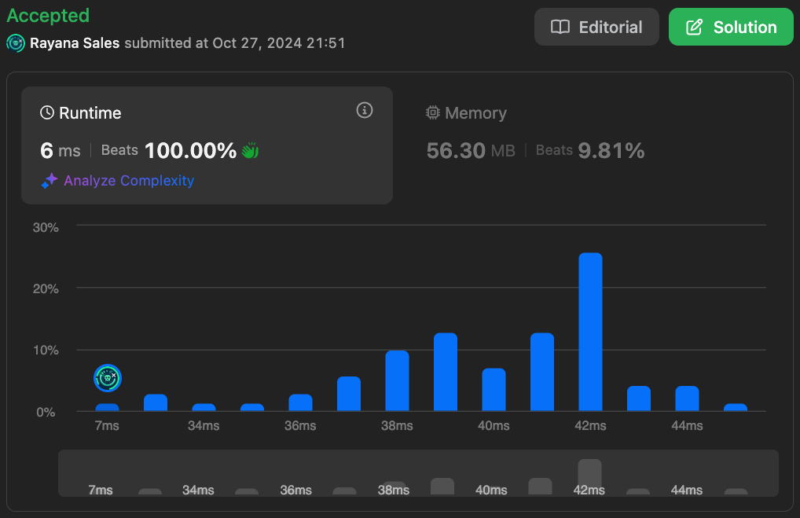

# 561. Array Partition

🌱 Difficulty: `Easy`

❤️ Leetcode Problem Description: [561. Array Partition - Problem - Description](https://leetcode.com/problems/array-partition/description/)

❤️ Leetcode Solution by Rayana Sales: [561. Array Partition - Solution](https://leetcode.com/problems/array-partition/solutions/5976396/topic)

💁🏻‍♀️ All my solved LeetCode problems on GitHub: [rayanasales/leetcode](https://github.com/rayanasales/leetcode)

❤️‍🔥❤️‍🔥❤️‍🔥 If it's help, please up 🔝 vote! ❤️‍🔥❤️‍🔥❤️‍🔥

---

## 🚀 Commented Solution

```javascript []
var arrayPairSum = function (nums) {
  const offset = 10000; // To handle negative numbers by shifting the range
  const frequency = new Array(20001).fill(0); // Array to store the frequency of each number.

  // Step 1: frequency occurrences of each number in nums
  for (let num of nums) {
    frequency[num + offset]++; // offset negative numbers to positive indices
  }

  let maxSum = 0;
  let shouldAdd = true; // Flag to decide whether to add the current number to maxSum

  // Step 2: Traverse through the frequency array to sum the minimum of pairs
  for (let i = 0; i < frequency.length; i++) {
    while (frequency[i] > 0) {
      if (shouldAdd) {
        maxSum += i - offset; // Convert index back to original number
      }
      // Toggle shouldAdd between true and false to pick every second element
      shouldAdd = !shouldAdd;
      frequency[i]--; // Decrease the frequency for this number
    }
  }

  return maxSum;
};
```

### Runtime 6 ms Beats 100%



---

## 💎 Strategy

The problem asks us to maximize the sum of the minimum values from each pair when we divide the array into pairs. To achieve this, we should pair numbers as closely together as possible, meaning that we want to sort the array and then take every second element as the "minimum" of each pair.

- `offset`: This is necessary to handle negative numbers because array indices can’t be negative. By shifting everything up by 10000, we can use a simple array to count occurrences of numbers from `-10000` to `10000`.
- `frequency` array: This holds the frequency of each number. Its size is `20001` to account for all possible values between `-10000` and `10000`.
- `shouldAdd` flag: We use this flag to decide whether to include the current number in our final sum, simulating the process of forming pairs by alternating the flag between `true` and `false`.

### Core Concept

If you sort the array, every second number (starting from the smallest) is the minimum of a pair. So, after sorting, taking every second element gives us the desired result.

### Why this works

When the numbers are close together, the minimum number in each pair is maximized. Pairing numbers that are far apart (like the smallest number with the largest number) results in a lower sum because the smallest number will be the minimum, and we want the minimums to be as large as possible.

### To optimize this strategy

The optimization here comes from avoiding the typical sorting operation, which has a time complexity of O(n log n). Instead, we:

1. Count the frequency of each number in a fixed-size array.
2. Traverse the frequency array in a way that simulates sorting, but much faster, since it's just a linear scan.

The result is a time complexity of O(n), which is the best possible for this problem.

---

## 🎃 Strategy for handling negative numbers

The array `nums` can contain both negative and positive numbers, but JavaScript arrays cannot have negative indices. So, we need to shift the range of numbers in such a way that all numbers (including negatives) map to non-negative indices in our `frequency` array.

Here’s how we do it:

1. offset Value:

   - We define a constant `offset = 10000`. This allows us to map negative numbers to positive indices.
   - The range of numbers in `nums` is from `-10000` to `10000`, so when we add `10000` to any number, it moves the number into the range `[0, 20000]`.

2. Mapping to the `frequency` Array:
   - To store the frequency of any number `num` in `nums`, we do this:
     ```javascript
     frequency[num + offset]++;
     ```
   - This means:
     - For positive numbers, the index is `num + 10000`, which directly shifts the positive number into the correct index range.
     - For negative numbers, adding `10000` turns the negative number into a positive index.

---

## 🔎 Step-by-Step Debugging

### Example 1:

Input: `nums = [1, 4, 3, 2]`

#### Step 1: Initial Setup

- offset = 10000
- We are shifting all numbers to the positive index range `[0, 20000]`.

#### Step 2: Count Frequency Phase

We iterate over each number in `nums` and update the `frequency` array:

| Original Number | Index Calculation   | Resulting Index in `frequency[]` | Explanation                           |
| --------------- | ------------------- | -------------------------------- | ------------------------------------- |
| `1`             | `1 + 10000 = 10001` | `frequency[10001]++`             | `1` gets mapped to `frequency[10001]` |
| `4`             | `4 + 10000 = 10004` | `frequency[10004]++`             | `4` gets mapped to `frequency[10004]` |
| `3`             | `3 + 10000 = 10003` | `frequency[10003]++`             | `3` gets mapped to `frequency[10003]` |
| `2`             | `2 + 10000 = 10002` | `frequency[10002]++`             | `2` gets mapped to `frequency[10002]` |

So after processing `nums = [1, 4, 3, 2]`, our `frequency` array will look like this (simplified for clarity):

```
frequency[10001] = 1  (for 1)
frequency[10002] = 1  (for 2)
frequency[10003] = 1  (for 3)
frequency[10004] = 1  (for 4)
```

#### Step 3: Summing Phase (Simulating the Pairs)

We now traverse the `frequency` array and pick every second number to simulate pairing:

- First pair:

  - We encounter `frequency[10001]` (which represents `1`), and since `shouldAdd = true`, we add `1` to `maxSum`.
  - Now, `shouldAdd = false`.

- Second pair:

  - We encounter `frequency[10002]` (which represents `2`), and since `shouldAdd = false`, we skip adding `2` and move on.
  - Now, `shouldAdd = true`.

- Third pair:

  - We encounter `frequency[10003]` (which represents `3`), and since `shouldAdd = true`, we add `3` to `maxSum`.
  - Now, `shouldAdd = false`.

- Fourth pair:
  - We encounter `frequency[10004]` (which represents `4`), and since `shouldAdd = false`, we skip adding `4`.

Result:

- `maxSum = 1 + 3 = 4`

---

### Example 2:

Input: `nums = [6, 2, 6, 5, 1, 2]`

#### Step 1: Initial Setup

- offset = 10000
- We'll shift all numbers to the positive index range.

#### Step 2: Count Frequency Phase

We iterate over each number in `nums` and update the `frequency` array:

| Original Number | Index Calculation   | Resulting Index in `frequency[]` | Explanation                           |
| --------------- | ------------------- | -------------------------------- | ------------------------------------- |
| `6`             | `6 + 10000 = 10006` | `frequency[10006]++`             | `6` gets mapped to `frequency[10006]` |
| `2`             | `2 + 10000 = 10002` | `frequency[10002]++`             | `2` gets mapped to `frequency[10002]` |
| `6`             | `6 + 10000 = 10006` | `frequency[10006]++`             | `6` gets mapped to `frequency[10006]` |
| `5`             | `5 + 10000 = 10005` | `frequency[10005]++`             | `5` gets mapped to `frequency[10005]` |
| `1`             | `1 + 10000 = 10001` | `frequency[10001]++`             | `1` gets mapped to `frequency[10001]` |
| `2`             | `2 + 10000 = 10002` | `frequency[10002]++`             | `2` gets mapped to `frequency[10002]` |

So after processing `nums = [6, 2, 6, 5, 1, 2]`, the `frequency` array will look like this (simplified for clarity):

```
frequency[10001] = 1  (for 1)
frequency[10002] = 2  (for 2)
frequency[10005] = 1  (for 5)
frequency[10006] = 2  (for 6)
```

#### Step 3: Summing Phase (Simulating the Pairs)

We now traverse the `frequency` array and pick every second number to simulate pairing:

- First pair:

  - We encounter `frequency[10001]` (which represents `1`), and since `shouldAdd = true`, we add `1` to `maxSum`.
  - Now, `shouldAdd = false`.

- Second pair:

  - We encounter `frequency[10002]` (which represents `2`), and since `shouldAdd = false`, we skip the first `2`.
  - Now, `shouldAdd = true`.
  - We encounter `frequency[10002]` again (since `frequency[10002] = 2`), and since `shouldAdd = true`, we add `2` to `maxSum`.
  - Now, `shouldAdd = false`.

- Third pair:

  - We encounter `frequency[10005]` (which represents `5`), and since `shouldAdd = false`, we skip adding `5`.
  - Now, `shouldAdd = true`.

- Fourth pair:
  - We encounter `frequency[10006]` (which represents `6`), and since `shouldAdd = true`, we add `6` to `maxSum`.
  - Now, `shouldAdd = false`.
  - We encounter `frequency[10006]` again (since `frequency[10006] = 2`), and since `shouldAdd = false`, we skip the second `6`.

Result:

- `maxSum = 1 + 2 + 6 = 9`

---

### Example 3 (negative numbers):

Input: `nums = [-470, 66, -4835, -5623]`

#### Step 1: Initial Setup

- offset = 10000

#### Step 2: Count Frequency Phase

We iterate over each number in `nums` and update the `frequency` array:

| Original Number | Index Calculation      | Resulting Index in `frequency[]` | Explanation                              |
| --------------- | ---------------------- | -------------------------------- | ---------------------------------------- |
| `-5623`         | `-5623 + 10000 = 5377` | `frequency[5377]++`              | `-5623` gets mapped to `frequency[5377]` |
| `66`            | `66 + 10000 = 10066`   | `frequency[10066]++`             | `66` gets mapped to `frequency[10066]`   |
| `-4835`         | `-4835 + 10000 = 5165` | `frequency[5165]++`              | `-4835` gets mapped to `frequency[5165]` |
| `-470`          | `-470 + 10000 = 9530`  | `frequency[9530]++`              | `-470` gets mapped to `frequency[9530]`  |

After processing `nums = [-470, 66, -4835, -5623]`, the `frequency` array will look like this:

```
frequency[5377] = 1  (for -5623)
frequency[5165] = 1  (for -4835)
frequency[9530] = 1  (for -470)
frequency[10066] = 1  (for 66)
```

#### Step 3: Summing Phase (Simulating the Pairs)

We now traverse the `frequency` array and pick every second number to simulate pairing:

- First pair:

  - We encounter `frequency[5165]` (which represents `-4835`), and since `shouldAdd = true`, we add `-4835` to `maxSum`.
  - Now, `shouldAdd = false`.

- Second pair:

  - We encounter `frequency[5377]` (which represents `-5623`), and since `shouldAdd = false`, we skip adding `-5623`.
  - Now, `shouldAdd = true`.

- Third pair:
  - We encounter `

frequency[9530]`(which represents`-470`), and since `shouldAdd = true`, we add `-470`to`maxSum`.

- Now, `shouldAdd = false`.

- Fourth pair:
  - We encounter `frequency[10066]` (which represents `66`), and since `shouldAdd = false`, we skip adding `66`.

Result:

- `maxSum = -4835 + (-470) = -6093`

---

## 📊 Time and Space Complexity Analysis

### Time Complexity:

- Counting Step: We iterate over the `nums` array to populate the `frequency` array. This takes O(n), where `n` is the length of the `nums` array.
- Summing Step: We iterate through the fixed-size `frequency` array (of length `20001`), which is constant with respect to the size of the input. Thus, this also takes O(n) time as we only loop based on the occurrences of the numbers.
- Therefore, the total time complexity is O(n).

### Space Complexity:

- We use a fixed-size array `frequency` of length `20001`, which doesn't depend on the input size `n`. Thus, the space complexity is O(1) for the `frequency` array plus O(n) for the input array.
- Hence, the overall space complexity is O(n).

---

# Please UPVOTE if this was helpful 🔝🔝🔝❤️❤️❤️

and check out all my solved LeetCode problems on GitHub: [rayanasales/leetcode](https://github.com/rayanasales/leetcode) 🤙😚🤘


