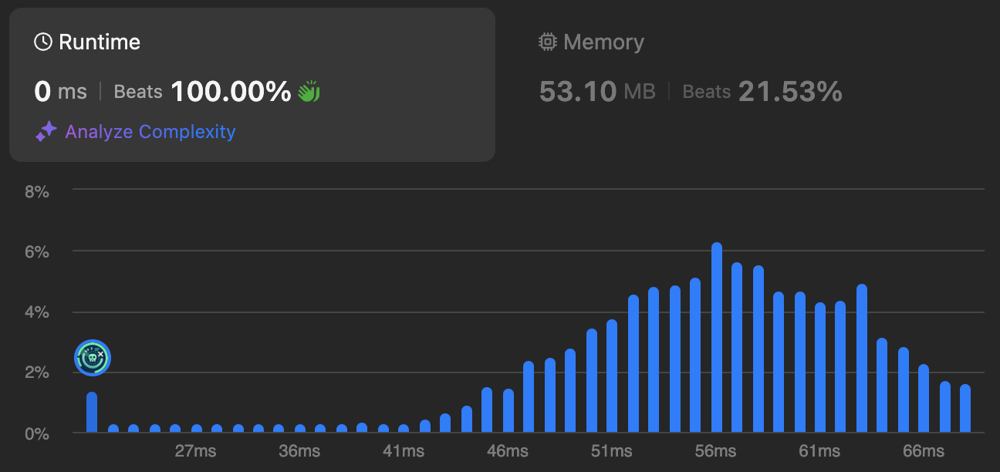

# 704. Binary Search

🌱 Difficulty: `Easy`

❤️ Leetcode Problem Description: [704. Binary Search - Problem - Description](https://leetcode.com/problems/binary-search/description/)

❤️ Leetcode Solution by Rayana Sales: [704. Binary Search - Solution](https://leetcode.com/problems/binary-search/solutions/5943740/topic/)

💁🏻‍♀️ All my solved LeetCode problems on GitHub: [rayanasales/leetcode](https://github.com/rayanasales/leetcode)

❤️‍🔥❤️‍🔥❤️‍🔥 If this helped you, please up 🔝 vote! ❤️‍🔥❤️‍🔥❤️‍🔥

---

## 🚀 Solution

```javascript []
var search = function (nums, target) {
  return nums.indexOf(target);
};
```

---

## 🔎 Explanation

- The `indexOf()` method returns the first index (position) of a specified value.
- The `indexOf()` method returns -1 if the value is not found.
- The `indexOf()` method starts at a specified index and searches from left to right (from the given start postion to the end of the array).
- By default the search starts at the first element and ends at the last.
- Negative start values counts from the last element (but still searches from left to right).

---

## 🛡️ Runtime Evidence



---

# Please UPVOTE if this was helpful 🔝🔝🔝❤️❤️❤️

and check out all my solved LeetCode problems on GitHub: [rayanasales/leetcode](https://github.com/rayanasales/leetcode) 🤙😚🤘


